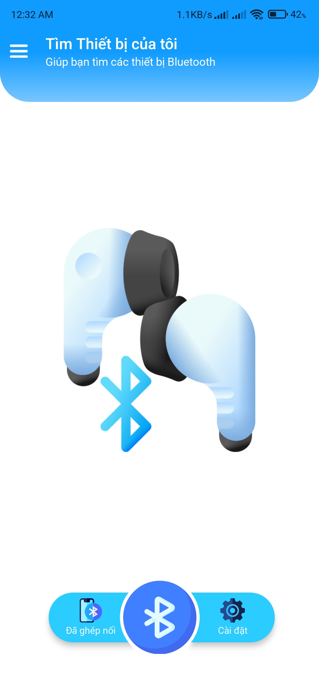
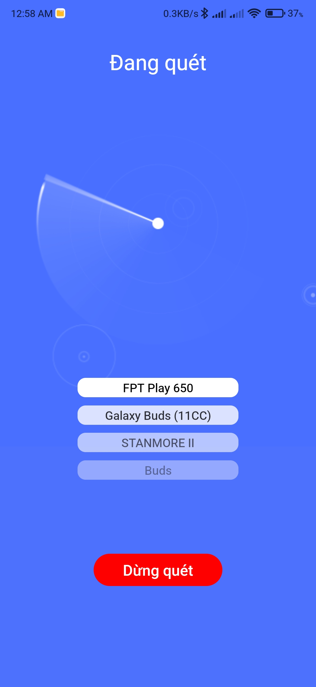

<h1 align="center">
    Find My Bluetooth Devices
</h1>

## Table of contents
1. [Introduction](#introduction)
2. [Demo](#demo)
3. [Requirements](#requirements)
4. [Development](#development)
5. [Contributors](#contributors)

## Introduction

A React Native application to find your lost Bluetooth devices in your house.

## Demo
 

## Requirements
- [**NodeJS**](https://nodejs.org/en/download/) (>= *v20*)
- An Android device with [**Developer Options**](https://developer.android.com/studio/debug/dev-options) enabled and [**USB Debugging**](https://developer.android.com/studio/debug/dev-options#Enable-debugging) activated.
- **Optional**: activate _Wireless Debugging_ allow for wire-free operation after the initial application installation.

## Developments
1. Clone the repository and change directory
```sh
$ git clone --depth 1 git@github.com:kienpro307/FindBluetoothDevice.git && cd ./FindBluetoothDevice
```

2. Install NodeJS dependencies
```sh
$ npm install
```

3. Clean Gradle
```sh
$ cd ./android && chmod +R gradlew && ./gradlew clean
```

4. Start the Metro Server
```sh
$ npx react-native start --reset-cache
```

5. Run Android
```sh
$ npx react-native run-android
```

6. (Optional, if _Wireless Debugging_ activated) Setup wireless debug host and port

**Inside your development machine, find the local IP address of your wireless NIC:**
```sh
# For both Linux and Windows
ifconfig
```

**Open your Android device and configure the debug server host and port:**

1. Open "Find My Devices" application after the initial application installation.
2. Shake the device to open the "Settings" menu.
3. Go to "Debugging".
4. Select "Debug server host & port for device".
5. Enter the following:
```txt
# Replace <ip_address> with the local IP address obtained in the previous step.
<ip address>:8081
```

## Contributors

|Name|Student ID|Description|
|:---:|:---:|:---|
|[Nguyễn Đức Kiên](https://github.com/kienpro307)|21020339|Team Leader, UI Designer, Architecture Designer, Programmer, Documenting, Presenter|
|[Bùi Hữu Việt Hùng](https://github.com/Silverbullet069)|20020106|Tech Researcher, UI Fixer, Programmer, Documenting, Presenter, Demo|
|[Đoàn Thị Minh Hằng](https://github.com/mhjame)|21020068|Programming, Documenting|


